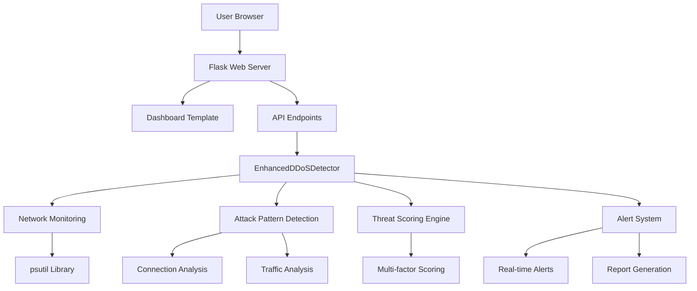
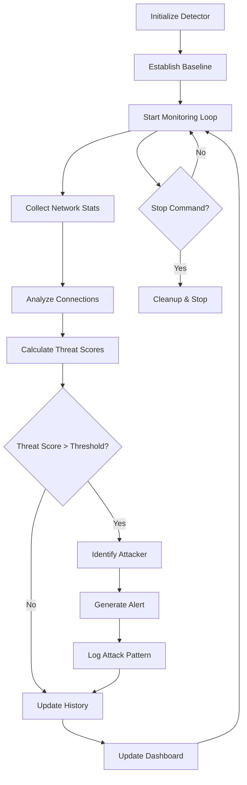

# Enhanced DDoS Monitor 🛡️

A sophisticated Flask-based web application for real-time DDoS (Distributed Denial of Service) attack detection and monitoring. This tool provides comprehensive network traffic analysis, threat scoring, and automated alerting to protect against various DDoS attack patterns.

## Features

- **Real-time Monitoring**: Continuous monitoring of network connections, traffic rates, and packet flows
- **Enhanced Attack Detection**: Advanced algorithms to detect SYN floods, connection floods, traffic floods, and port scanning
- **Threat Scoring System**: Multi-factor threat assessment with configurable sensitivity levels
- **Interactive Dashboard**: Modern web interface with real-time charts and alerts using Chart.js and Bootstrap
- **Attacker Identification**: Automatic identification and scoring of suspicious endpoints with detailed threat indicators
- **Baseline Establishment**: Adaptive baseline learning to distinguish normal traffic from attacks
- **Comprehensive Reporting**: Generate detailed attack reports with export capabilities
- **Configurable Settings**: Adjustable thresholds, alert sensitivity, and monitoring intervals
- **System Integration**: Leverages psutil for deep system and network statistics
- **Audio/Visual Alerts**: Browser notifications and sound alerts for critical events
- **Simulation Mode**: Built-in attack simulation for testing and demonstration

## Installation

### Prerequisites
- Python 3.7+
- Windows/Linux/macOS

### Setup
1. Clone or download the project files
2. Navigate to the project directory
3. Install dependencies:
   ```bash
   pip install -r requirements.txt
   ```

## Usage

### Starting the Application
```bash
python run.py
```

The application will start on `http://127.0.0.0:8070` and automatically open in your default browser.

### Dashboard Overview
- **Connections Card**: Shows active connections with threshold progress bar
- **Traffic Card**: Displays network traffic rates (KB/s)
- **System Stats**: CPU and memory usage monitoring
- **Real-time Charts**: Historical data for connections and traffic
- **Process List**: Top processes by connection count
- **Endpoint Analysis**: Remote endpoints with connection details
- **Security Alerts**: Live alert feed with severity levels

### Controls
- **Start/Stop**: Begin or halt monitoring
- **Settings**: Configure thresholds and sensitivity
- **Reports**: Generate and download attack reports
- **Simulation**: Test detection with simulated attacks

## Architecture



## Monitoring Process



## API Endpoints

| Endpoint | Method | Description |
|----------|--------|-------------|
| `/` | GET | Main dashboard page |
| `/data` | GET | Real-time monitoring data (JSON) |
| `/start` | GET | Start monitoring system |
| `/stop` | GET | Stop monitoring system |
| `/settings` | POST | Update monitoring settings |
| `/report` | GET | Generate attack report |
| `/report/download` | GET | Download report as text file |
| `/export` | GET | Export all data as JSON |
| `/alerts` | GET | Get alerts with filtering |
| `/suspicious` | GET | Get suspicious endpoints |
| `/baseline/reset` | POST | Reset baseline |
| `/test/simulate` | POST | Simulate attack for testing |
| `/status` | GET | Get system status |

## Configuration

### Settings Parameters
- **Connection Threshold**: Maximum allowed connections before critical alert
- **Alert Threshold**: Warning level percentage of connection threshold
- **Update Interval**: Monitoring sampling frequency in milliseconds
- **Ignore Loopback**: Exclude localhost connections from detection
- **Ignore Self IPs**: Exclude host's own IP addresses
- **Server Port**: Specific port to monitor (optional)
- **Count Only Established**: Focus on established connections only

### Advanced Configuration
The detector includes additional internal settings:
- Spike detection sensitivity: 2.0x baseline
- Minimum spike threshold: 50 KB
- Traffic flood threshold: 5.0x baseline
- Threat score minimum: 30 points
- Rapid connection threshold: 10/min
- Port scan threshold: 5 ports

## Attack Detection Patterns

The system detects multiple DDoS attack types:

- **SYN Flood**: High ratio of half-open connections
- **Connection Flood**: Excessive established connections
- **Traffic Flood**: Massive data transfer rates
- **UDP Flood**: Packet-based flooding
- **ICMP Flood**: Ping flood attacks
- **Port Scanning**: Sequential port probing
- **Slowloris**: Slow connection attacks

## Threat Scoring

Each suspicious endpoint receives a threat score based on:

1. **Connection Count**: Absolute number of connections
2. **Connection Velocity**: Connections per minute
3. **Port Targeting**: Number of different ports accessed
4. **State Anomalies**: Unusual connection state ratios
5. **Process Involvement**: Multiple processes targeted

## Frontend Features

- **Responsive Design**: Bootstrap-based mobile-friendly interface
- **Real-time Updates**: WebSocket-free polling for live data
- **Interactive Charts**: Chart.js powered historical graphs
- **Alert System**: Color-coded alerts with severity levels
- **Modal Details**: Detailed endpoint and alert information
- **Keyboard Shortcuts**: Ctrl+S (start), Ctrl+X (stop), Ctrl+R (report)
- **Browser Notifications**: Desktop notifications for alerts
- **Audio Alerts**: Sound notifications for critical events

## Logging and Reports

- **File Logging**: All events logged to `ddos_monitor.log`
- **Console Output**: Real-time logging to terminal
- **Attack Reports**: Detailed incident summaries
- **Data Export**: JSON export of all monitoring data
- **Baseline Info**: Normal traffic patterns documentation

## Security Considerations

- Local IP exclusion to prevent false positives
- Configurable whitelisting
- Threat score thresholds to reduce noise
- Baseline establishment for adaptive detection
- Detailed logging for forensic analysis

## Development

### Project Structure
```
monitoring-v9/
├── run.py                 # Application entry point
├── app/
│   ├── __init__.py       # Flask app factory
│   ├── detector.py       # Core detection logic
│   ├── routes.py         # API endpoints
│   ├── templates/
│   │   └── dashboard.html # Main dashboard
│   └── static/
│       ├── app.js        # Frontend logic
│       └── style.css     # Custom styles
├── requirements.txt      # Python dependencies
├── README.md            # This file
└── version.txt          # Version information
```

### Extending the System

The `EnhancedDDoSDetector` class can be extended with:
- Additional attack pattern detection
- Custom threat scoring algorithms
- Integration with external security systems
- Machine learning-based anomaly detection

## Troubleshooting

### Common Issues
- **Permission Errors**: Run with appropriate privileges for network monitoring
- **Port Conflicts**: Change port in `run.py` if 8070 is occupied
- **Browser Issues**: Ensure JavaScript is enabled for full functionality
- **High CPU Usage**: Increase monitoring interval in settings

### Debug Mode
Enable debug logging by modifying the logging configuration in `detector.py`.

## License

This project is open-source. Please refer to the license file for details.

## Version

Current Version: 5.1

---

**Note**: This tool is designed for monitoring and detection purposes. For production deployment, consider additional security measures and professional security assessment.
