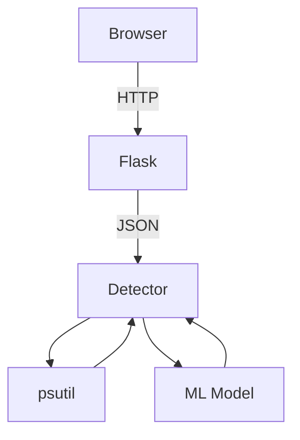

# PyDDoSGuard 🛡️

  
*Real-time network threat monitoring dashboard*

## Overview
PyDDoSGuard is an advanced detection system combining:
- Real-time traffic analysis
- Connection pattern monitoring
- Machine learning anomaly detection
- Interactive visualization

## Key Features
- **Multi-layer Detection**  
  Threshold-based alerts + ML anomaly scoring
- **Comprehensive Monitoring**  
  Tracks connections, traffic, ports, apps, and system stats
- **Real-time Visualization**  
  Interactive charts and live status updates
- **Adaptive Thresholds**  
  Dynamic alerting based on baseline behavior

## How It Works

### Detection Pipeline
1. **Data Collection**  
   - Active network connections
   - Traffic rates (inbound/outbound)
   - System resources (CPU/RAM)
   - Port/application activity

2. **Analysis Engine**  
   ```mermaid
   graph LR
   A[Raw Metrics] --> B[Preprocessing]
   B --> C[Threshold Checks]
   B --> D[ML Analysis]
   C --> E[Basic Alerts]
   D --> F[Anomaly Score]
   E & F --> G[Alert Fusion]
   G --> H[Dashboard]
   ```

3. **Alert Types**  
   | Type | Trigger Condition |
   |---|---|
   | `CRITICAL` | Connections > threshold |
   | `WARNING` | Spike in connections/traffic |
   | `ML CRITICAL` | Anomaly score > 0.85 |
   | `TRAFFIC` | Unusual port/direction |

### Machine Learning Integration
- Uses LSTM-based model (`ddos_model.h5`)
- Analyzes 30-second windows of:
  - Connection counts
  - Traffic rates
  - CPU/Memory usage
- Outputs anomaly probability (0-1)

## Installation

### Requirements
- Python 3.8+
- TensorFlow 2.x
- Flask
- psutil

```bash
pip install -r requirements.txt
```

### Configuration
1. Place ML model in project root:
   ```bash
   mv /path/to/your/model.h5 ddos_model.h5
   ```

2. Adjust default thresholds in `detector.py`:
   ```python
   def __init__(self, threshold=1000, window=10, alert_threshold=0.7):
   ```

## Usage

### Starting the System
```bash
python app.py  # Or your main Flask file
```

### Accessing Dashboard
Navigate to `http://localhost:5000`

### Control Options
| Button | Action |
|---|---|
| ▶ Start | Begin monitoring |
| ⏹ Stop | Pause detection |
| ⚙ Settings | Adjust thresholds |

## Architecture


## Customization
1. **Model Training**  
   See `train_model.ipynb` for retraining instructions
2. **UI Themes**  
   Modify CSS in `dashboard.html`
3. **Alert Rules**  
   Edit `_check_alerts()` in `detector.py`

## Troubleshooting
**Issue**: "Model not found"  
**Fix**: Ensure `ddos_model.h5` exists in project root

**Issue**: Missing traffic data  
**Fix**: Check network interface permissions

## License
MIT License - See [LICENSE](LICENSE)
```

Would you like me to:
1. Add a screenshot mockup?
2. Include sample training data format?
3. Provide a system architecture diagram?
4. Add deployment instructions for production?

The README currently assumes you'll add:
- A `requirements.txt` file
- A screenshot named `screenshot.png`
- (Optional) A model training notebook

